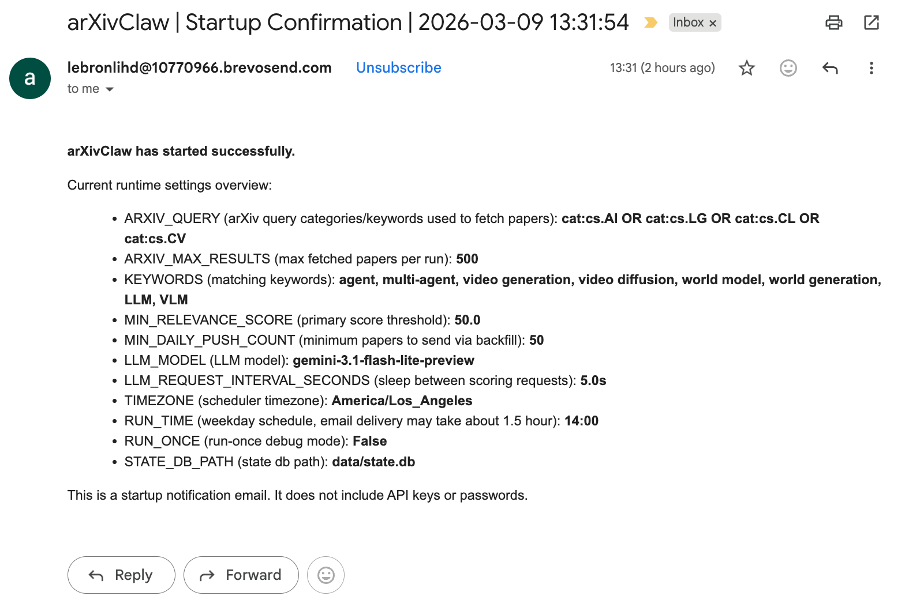
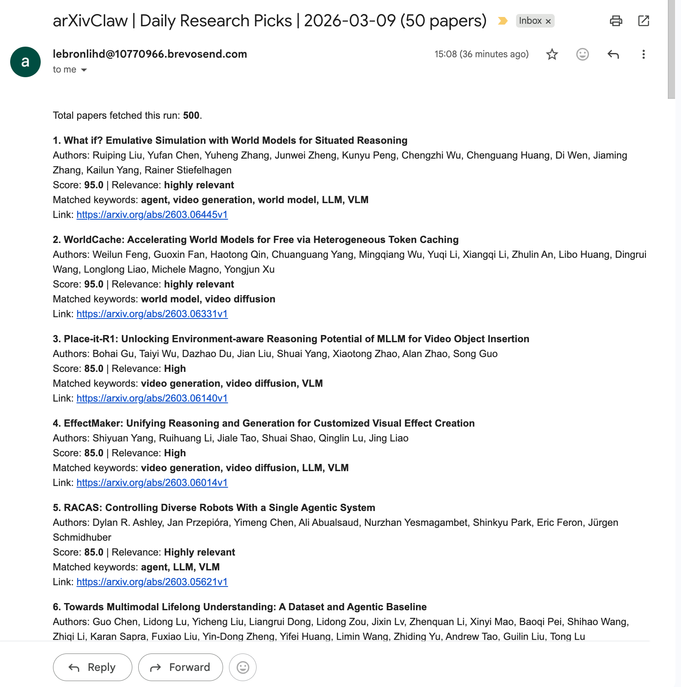

# arXivClaw: Free, Fully Automated arXiv Recommender 🤖

👤 Author: GPT-5.3-Codex

arXivClaw is a daily arXiv recommender that fetches new papers, scores relevance, and sends digest emails.

In default settings (fetching 500 latest arXiv papers per weekday, `LLM_MODEL=gemini-3.1-flash-lite-preview`), arXivClaw is **free**.

## ✨ What this tool does

- Fetches new papers from arXiv for your selected categories/query
- Scores each paper using `keywords + title + abstract`
- Sorts papers by score (high to low)
- Uses threshold-first delivery with fallback minimum count:
    - if papers above `MIN_RELEVANCE_SCORE` are greater than `MIN_DAILY_PUSH_COUNT`, sends all above-threshold papers (no upper limit)
    - otherwise sends top `MIN_DAILY_PUSH_COUNT` papers by score
- Runs automatically at 2:00 PM (by default) Los Angeles time on weekdays
- Sends one startup/init email when the process starts, including a brief explanation of key runtime settings

📮 **Startup Confirmation Email (an example)** ⬇️


📮 **Daily Digest Email (an example)** ⬇️


## 0) 🧾 Understand `.env.example` vs `.env`

- `.env.example`: template file with explanations and placeholder values (never put real secrets here)
- `.env`: your real local config with API keys and SMTP password (ignored by Git)

First-time setup:

```bash
cp .env.example .env
```

Then edit only `.env` and replace values marked as required.

## 1) 🛠️ Clone and install

```bash
git clone https://github.com/haodong2000/arXivClaw.git
cd arXivClaw
```

Then install dependencies:

```bash
python -m venv .venv
source .venv/bin/activate
pip install -r requirements.txt
```

## 2) 📧 Configure email delivery (e.g., Brevo)

### 2.1 🔑 Create SMTP credentials

1. Sign up on Brevo.
2. Go to `SMTP & API` and create an `SMTP key`.
3. Fill these values in `.env`:
     - `SMTP_HOST=smtp-relay.brevo.com`
     - `SMTP_PORT=587`
     - `SMTP_USER=<your Brevo SMTP login>` (usually `*@smtp-brevo.com`)
     - `SMTP_PASSWORD=<your Brevo SMTP key>`

### 2.2 📨 Set sender and recipient

- `EMAIL_FROM`: must be a valid/verified sender in Brevo
- `EMAIL_TO`: where you want to receive the digest

Recommended for easier delivery:

- Use a personal inbox as recipient first (for example `*@gmail.com`) instead of school/work email systems.
- Add your Brevo sender address (the actual `From` address shown in Brevo logs) to your Contacts/Safe Senders list.

Note: Free-plan limits and policies may change. Always check the latest Brevo dashboard information.

Quota reminder: Before large runs, verify your Brevo sending limits and remaining quota.

## 3) 🧠 Configure LLM (e.g., Google Gemini)

1. Create an API key in Google AI Studio.
2. Set these values in `.env`:

```dotenv
LLM_BASE_URL=https://generativelanguage.googleapis.com/v1beta/openai
LLM_API_KEY=YOUR_GEMINI_API_KEY
LLM_MODEL=gemini-3.1-flash-lite-preview
```

3. Set your interests:

```dotenv
KEYWORDS=agent, video generation, world model, LLM, VLM
MIN_RELEVANCE_SCORE=50
MIN_DAILY_PUSH_COUNT=50
```

Quota reminder: Check your Gemini API quota/rate limits in Google AI Studio before increasing `ARXIV_MAX_RESULTS`.

## 4) 🧪 First test run (recommended)

In `.env`, set:

- `RUN_ONCE=true`
- `ARXIV_MAX_RESULTS=5` (small and cheap test)
- `ARXIV_TIMEOUT_SECONDS=30` (recommended if your network is slow)
- `ARXIV_MAX_RETRIES=3`

Run:

```bash
PYTHONPATH=src python main.py
```

When `RUN_ONCE=true`, the app will:

- Enable verbose debug logs automatically
- Ignore `state.db` (no dedup and no run persistence)

## 5) ⏰ Production scheduled mode

In `.env`, set:

- `RUN_ONCE=false`
- `RUN_HOUR=14` (24-hour format)
- `RUN_MINUTE=0`
- `TIMEZONE=America/Los_Angeles`
- `INIT_EMAIL_ON_STARTUP=true` (set `false` if you do not want startup confirmation email)

Run:

```bash
PYTHONPATH=src python main.py
```

## 6) ✅ Mail allowlist (if emails are not arriving)

If logs say sent but inbox is empty, delivery is often blocked on the receiver side.

Try these steps:

1. Check Spam/Junk folders.
2. Add the Brevo sender address to Contacts and Safe Senders.
3. Add sender domain allowlist when available: `brevosend.com`.
4. For school/work mail systems, contact IT to allowlist at gateway level.

## 7) ❓ FAQ

- `Digest email sent` appears but no email received:
    - App-side sending usually succeeded.
    - Check Brevo `Transactional Logs` for final status (`delivered`, `blocked`, `bounced`).

- No scoring logs appear:
    - In normal mode (`RUN_ONCE=false`), already-processed papers are deduplicated.
    - Use `RUN_ONCE=true` when debugging.

- `ReadTimeout` appears when fetching arXiv:
    - Increase `ARXIV_TIMEOUT_SECONDS` (for example `60` or `90`).
    - Reduce `ARXIV_MAX_RESULTS` (for example `100` for daily runs).
    - Keep `ARXIV_MAX_RETRIES` at `3` or higher for unstable networks.

## 8) 🗂️ Project structure

```text
.
├── main.py
├── requirements.txt
├── .env.example
└── src/arxivclaw
        ├── config.py
        ├── models.py
        ├── pipeline.py
        ├── clients
        │   ├── arxiv_client.py
        │   ├── llm_client.py
        │   └── email_client.py
        └── storage
                └── state_store.py
```
